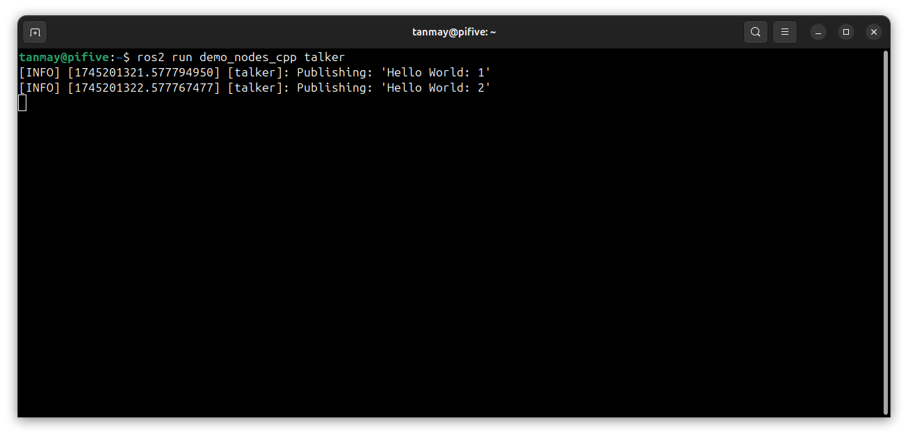
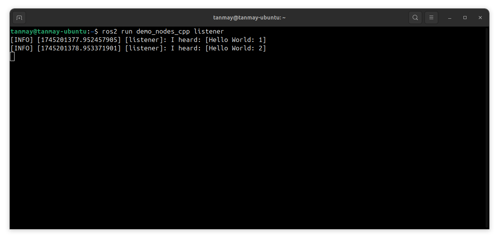

# ELI5 README (WIP)

## Installation ([Ubuntu 24.04](https://releases.ubuntu.com/noble/)

- On desktop
  - Download ISO from the [official website](https://ubuntu.com/download/desktop)
  - Make bootable USB using [Rufus](https://rufus.ie/en/)
  - Install (Dual-boot or Standalone)
- On Raspberry Pi
  - Download [Pi Imager](https://www.raspberrypi.com/software/)
  - Select Ubuntu 24.04 Server in the Imager
  - Customize OS settings in Imager
    - hostname\
    allows you to connect to the Pi through a terminal using\
    ```ssh {USERNAME}@{HOSTNAME}.local```
    - Username, Password
    - WiFi settings\
    to connect to the WiFi network
    - Enable SSH \
    allows you to connect to the Pi over SSH from the get-go, with no further setup required. Else you will need to connect the Pi to a monitor and setup
  - Flash to Micro SD card using Imager

## Installation (Software)

- Install [Git](https://git-scm.com/downloads/linux)\
Git is essential for repository management and version control
- Install [ROS2 (jazzy)](https://docs.ros.org/en/jazzy/Installation.html)\
Read this [section](#understanding-ros) if the question - "Why ROS?"
  - Desktop-specific
    - Install ros-jazzy-desktop
    - Check out [ROS tutorials](https://docs.ros.org/en/jazzy/Tutorials.html) to understand its features
  - Raspberry Pi-specific
    - Install ros-jazzy-ros-base\
    Since the Pi is running in [headless mode](https://en.wikipedia.org/wiki/Headless_software), the desktop version is unnecessary. More details on the differences [here](https://www.ros.org/reps/rep-2001.html#id32)
    - Install demo talkers\
    ```sudo apt install ros-jazzy-demo-nodes-cpp ros-jazzy-demo-nodes-cpp-native ros-jazzy-demo-nodes-py```\
    to test whether the ROS2 nodes on desktop and Pi can communicate

    - Install [colcon](https://docs.ros.org/en/jazzy/Tutorials/Beginner-Client-Libraries/Colcon-Tutorial.html)
    - Install [rosdep](https://docs.ros.org/en/jazzy/Tutorials/Intermediate/Rosdep.html)
    - Initialize rosdep by running ```rosdep``` and following the commands
- Setup repository
  - Fork this repository on Github (optional, but recommended if you intend to customize your project and track changes using Git on GitHub)
  - Clone forked repository on computer (clone this repo if you haven't forked)
- Enable camera support
  - Build libcamera and rpicam-apps from source following this [guide](https://www.raspberrypi.com/documentation/computers/camera_software.html#building-libcamera)
    - (optional) When building rpicam-apps, enable libav support to allow capturing video
    - libcamera that comes with apt does not detect Pi Camera on Ubuntu\
    Hence, these libraries must be built from the [fork](https://github.com/raspberrypi/libcamera) developed by raspberrypi
  - Install [libcamera support for ROS2](https://github.com/christianrauch/camera_ros) on Pi
    - (Note) Installation using ```sudo apt install ros-$ROS_DISTRO-camera-ros``` breaks the libcamera/rpicam-apps\
    ```libcamera-hello``` no longer is able to find a camera
    - Follow the *Build Instructions - Source* to enable camera support for ROS2.
    - To start the camera stream, use the command\
    ```ros2 run camera_ros camera_node```
    - To visualize the camera stream, use the command\
    ```ros2 run rqt_image_view rqt_image_view```\
    If the image is inverted, use the command\
    ```ros2 run camera_ros camera_node --ros-args -p orientation:=180```\
    To set resolution, use the command\
    ```ros2 run camera_ros camera_node --ros-args -p orientation:=180 -p width:=800 -p height:=600```
    - To get better frame rate on the stream, use /camera/image_raw/compressed node
    - If you face issues getting the /image/compressed working, you may need to install *image-transport-plugins* using\
    ```apt install ros-$ROS_DISTRO-image-transport-plugins```
    - TODO some warnings on launching the camera node, related to calibration file and autofocus. Ignoring for now
    

## ROS2 Installation verification

- Run ```ros2 run demo_nodes_cpp talker``` on Pi
- Run ```ros2 run demo_nodes_cpp listener``` on Desktop
- **Expectation**: The listener [node](https://docs.ros.org/en/jazzy/Tutorials/Beginner-CLI-Tools/Understanding-ROS2-Nodes/Understanding-ROS2-Nodes.html) on the Desktop receives and displays messages sent by the talker [node](https://docs.ros.org/en/jazzy/Tutorials/Beginner-CLI-Tools/Understanding-ROS2-Nodes/Understanding-ROS2-Nodes.html) on the Raspberry Pi
  
  

## Understanding ROS

- **What is ROS?**\
Imagine you have a robot made of different parts - sensors to see, motors to move, and maybe even a camera to record\
Each part may speak its own "language". ROS helps them all talk to each other smoothly\
ROS is a essentially a software Lego set for building robotic systems. It provides ready-made tools and libraries to handle common tasks like controlling actuators, processing sensor data, or even communicating with other robots\
In short, ROS is the software glue that connects all the hardware and software pieces of a robot, making it easier to build, program, and control robots.
- **Understand the basic tools** ROS2 provides with [Beginner: CLI Tools](https://docs.ros.org/en/jazzy/Tutorials/Beginner-CLI-Tools.html) section

## Gazebo Simulation

- WIP future
